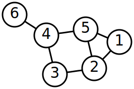

Title: Indirect function calls and control flow integrity
Date: 2022-08-28
Category: Security
Tags: Compilers, CFI
Summary: The "art" of programming is very similar to navigating through a cornfield maze. Planning is important, backtracking is often necessary, and it would all be trivial if you could just see the bigger picture from the beginning.

## Introduction

### Cornfield Chase

The "art" of programming is very similar to navigating through a cornfield maze. Planning is important, backtracking is often necessary, and it would all be trivial if you could just see the bigger picture from the beginning.

As many of you know, the same caveats apply not just when writing programs, but also when executing them. Whenever the CPU has finished executing a function, it has to return execution to where it was called from (the call site, or caller). Similarly, when calling a function, it has to move execution to said function (also know as the callee). Lastly, there are also jumps within a function, i.e. a loop or a condition with two branches.

This concept, both in programming and program execution, is known as **Control Flow**. It is the topic of todays blog, and the source of joy and pain (mostly pain) amongst programmers, toolchain engineers, security researchers and hardware engineers all across the globe.

Similarly to how seeing the bigger picture in a cornfield maze  is tremendeously helpful to the stuck explorer, and seeing the bigger picture in programming would avoid many nights of refactoring, seeing control flow ahead of having to execute it is helpful to the CPU aswell. For example, the CPU can start loading data that will be required in the near future while it is still busy executing the current function. The related concepts are called Pipelining, Prefetching and Speculative Execution, but these are not the topic of today's blog.

### Compilers, your friend and helper!

If we backtrack a little, there is this magical piece of software between the program and the CPU, the compiler. Most of you will associate this word with enigmatic error messages or convoluted installation tutorials, but please remain calm for just a little longer.

You see, the compiler is not just responsible for transforming your (surely sublime and infallible) code into a binary the CPU can execute, it is also responsible for augmenting the efficiency with which your program runs.

Programming languages don't map 1:1 to CPU instructions. They don't even map 1:1 to simple abstractions such as the Turing Machine. It is the compiler's job not just to map it to CPU instructions, but to do so in the most efficient way possible. The optimizations modern compilers apply are truly mind bending and the result of a never ending interdisciplinary effort between computer scientists, mathematicians, programmers and hardware engineers. Did you know that the same maths is involved in solving a Sudoku, creating inconvenient timetables for your university lectures, and allocating CPU registers?

<details open>
    <summary>Different ways of expressing the same code</summary>

```
int pow(int a, int exp) {
    int ret = 1;
    for(int i = 0; i < exp; i++) {
        ret = a * ret;
    }
    return ret;
}

# gcc -O0
pow(int, int):
        sub     sp, sp, #32
        str     w0, [sp, 12]
        str     w1, [sp, 8]
        mov     w0, 1
        str     w0, [sp, 28]
        str     wzr, [sp, 24]
        b       .L2
.L3:
        ldr     w1, [sp, 28]
        ldr     w0, [sp, 12]
        mul     w0, w1, w0
        str     w0, [sp, 28]
        ldr     w0, [sp, 24]
        add     w0, w0, 1
        str     w0, [sp, 24]
.L2:
        ldr     w1, [sp, 24]
        ldr     w0, [sp, 8]
        cmp     w1, w0
        blt     .L3
        ldr     w0, [sp, 28]
        add     sp, sp, 32
        ret

# gcc -O2
pow(int, int):
        mov     w3, w0
        cmp     w1, 0
        ble     .L4
        mov     w2, 0
        mov     w0, 1
.L3:
        add     w2, w2, 1
        mul     w0, w0, w3
        cmp     w1, w2
        bne     .L3
        ret
.L4:
        mov     w0, 1
        ret

# gcc -Os
pow(int, int):
        mov     w3, w0
        mov     w2, 0
        mov     w0, 1
.L2:
        cmp     w2, w1
        blt     .L3
        ret
.L3:
        mul     w0, w0, w3
        add     w2, w2, 1
        b       .L2
```

</details>

Similar to how the CPU benefits from seeing control flow ahead of execution, so does the compiler. If the compiler recognizes that a particular function is called frequently with specific arguments, it may decide to create seperate instances of this function optimized for a particular set of arguments. On the other end, if the compiler sees that a function is defined but never called across the whole program, it can just remove it entirely.

## Control Flow in Software

### Getting Graphical

In computer science, Control Flow is represented as a graph. A graph is a mathematical structure consisting of of vertices (also called nodes), individual points representing objects (in this case functions), and edges connecting the nodes (in this case function calls).



Graphs are one of the most common data structures in all of computer science. There is an entire field of mathematics dedicated to them, called Graph Theory. In the case of control flow, we use a particular subset of graphs called directed graphs. A directed graph (also called digraph) is a graph in which the edges carry a notion of direction. Let's look at a more applicable example, a call graph of a C program.


Immediately we can see a few interesting things:

* All calls can be traced back the the `main` function
* The `debug` function is never called
* `parse` is only called by `main`
* `printf` is called by more than one function

And accordingly, the compiler can do the following trivial optimizations:

* The `debug` function can be eliminated entirely
* The call to the `parse` function can be eliminated, and the function body inlined into `main` instead

We have made our binary smaller by removing an unused function, and also faster by removing the overhead of a function call. Inlining is particularly important because it gives way to many more optimizations within the function body, but this is worthy of a whole blog series in itself and out of scope here.

At first glance, life looks simple. We can see all the function calls at compile time, can apply all sorts of fancy optimizations, and the CPU can easily recognize which function will be called next and prepare adequately. Things will be BLAZING fast.

And then, there's indirect function calls.

### Indirect Functions, Direct Pain

Indirect function calls, usually encountered in the form of dynamic dispatch, are function calls where the callee is not known at compile time. This is a common occurrence, especially in object oriented programming, which is arguably the most successful programming paradigm.

This complicates things a lot. Even though a function is not directly called anywhere, it may be called indirectly at any point within a binary, or even across library boundaries. Suddenly, identifying unused functions becomes extremely difficult, and inlining of indirect calls is obviously not possible as the function to be inlined is not known to the compiler.

To little surprise, CPUs dislike indirect calls just as much as compilers do. Calls to non-constant locations are difficult to predict, and previous predictions become useless when the target function changes.

Compilers aren't powerless against this. With sufficient information about the program, it can be possible to build a hierarchy of all available targets for an indirect function call, and emit optimized machine code appropriately. In some cases, it can even determine the target precisely at compile time, and thus replace the indirect call with a direct one. This field of optimization is called devirtualization (stemming from indirect functions often being called virtual functions in OOP languages), and it has seen huge advancements within the last decade particularly due to the increased adoption of whole program optimization.

<details open>
    <summary>Devirtualization in practice</summary>

```
struct Base {
    virtual void vcall();
};

struct Derived : Base {
    void vcall() override;
};

void call_virtual(Base &b) {                        // A Base& can also point to any derived type,
    b.vcall();                                      // so we must go through the vtable to find the
}                                                   // implementation of our actual type.

void call_devirtualized() {
    Derived d;                                      // But here, the compiler can see that it points
    Base &b = d;                                    // to an instance of Derived specifically,
    b.vcall();                                      // and emits a direct call to Derived::vcall() instead.
}
# gcc -O3
call_virtual(Base&):
        ldr     x1, [x0]                            # Load the vtable location
        ldr     x1, [x1]                            # Load the function address from the vtable
        mov     x16, x1
        br      x16                                 # Jump to the function address
call_devirtualized():
        stp     x29, x30, [sp, -32]!
        adrp    x1, _ZTV7Derived+16
        add     x1, x1, :lo12:_ZTV7Derived+16
        mov     x29, sp
        add     x0, sp, 24
        str     x1, [sp, 24]
        bl      Derived::vcall()                    # This is a direct function call instead
        ldp     x29, x30, [sp], 32
        ret
```

</details>

There is one vastly bigger problem with indirect functions than just performance, though: security.

### One Dirty JOP

Indirect functions are pretty much always implemented via function pointers. These pointers point to the desired function, and since said function may be chosen at any time, the pointer has to reside in writable memory. This is in itself not a problem, assuming the rest of the program works fine, but it allows an attacker who can manipulate specific areas of memory to not just manipulate data, but also control flow. In essence, indirect functions make it easier for attackers to gain full control over a compromised application. This attack technique is called **Jump Oriented Programming**.

## Control Flow Integrity

Naturally, both our beloved compiler and hardware engineers are aware of this issue, and provide effective mitigations. The effort of preventing control flow manipulation is called Control Flow Integrity. CFI for function calls specifically is called **forward edge CFI**, as we are interested in traversing the control flow graph in a forward direction. Protecting the other direction (which function to return execution to) is called backward edge CFI. We will only deal with forward edge CFI here, as the backward edge case is simpler and mostly solved.

### CFI in Software

CFI is best implemented where we have the clearest view of control flow, the compiler. In general, forward edge CFI works by restricting the locations an indirect call can reach. There are two compilers implementing forward edge CFI.

#### Clang CFI

Clang offers the most effective CFI mitigation out of all available hardware and software options. Clangs forward edge CFI is called... CFI. I'll refer to it as [Clang CFI](https://clang.llvm.org/docs/ControlFlowIntegrity.html) for clarity.

Clang CFI makes use of the indirect function hierarchy that was originally collected for optimization purposes. Clang CFI collects all possible targets for a given indirect call, and amends the call with a check that asserts that the function pointer points to one of the possible targets.

<details open>
    <summary>Clang CFI codegen in detail</summary>

Let's look at the LLVM bitcode generated by a virtual call. Most readers will likely have never looked at LLVM bitcode before, but the syntax reads very similarly to C. We look at LLVM bitcode instead of the resulting assembly because Clang CFI has various optimized schemes that differ between the exact type of indirect call.
```
struct Base {
    virtual void vcall();
};

void call_virtual(Base &b) {
    b.vcall();
}

# clang++ -O3 -S -emit-llvm
; Function Attrs: mustprogress uwtable
define hidden void @_Z12call_virtualR4Base(%struct.Base* noundef nonnull align 8 dereferenceable(8) %0) local_unnamed_addr #0 {
  %2 = bitcast %struct.Base* %0 to void (%struct.Base*)***
  %3 = load void (%struct.Base*)**, void (%struct.Base*)*** %2, align 8, !tbaa !7
  %4 = load void (%struct.Base*)*, void (%struct.Base*)** %3, align 8
  tail call void %4(%struct.Base* noundef nonnull align 8 dereferenceable(8) %0)
  ret void
}
```
Similarly to the two loads in the compiled vcall example above, we see two load instructions here aswell. One loads the vtables address, the other the function's address from the vtable. So far, nothing exciting. Let's enable Clang CFI.
```
# clang++ -O3 -S -emit-llvm -flto -fvisibility=hidden -fsanitize=cfi
; Function Attrs: mustprogress uwtable
define hidden void @_Z12call_virtualR4Base(%struct.Base* noundef nonnull align 8 dereferenceable(8) %0) local_unnamed_addr #0 !type !6 !type !7 {
  %2 = bitcast %struct.Base* %0 to void (%struct.Base*)***
  %3 = load void (%struct.Base*)**, void (%struct.Base*)*** %2, align 8, !tbaa !8
  %4 = bitcast void (%struct.Base*)** %3 to i8*, !nosanitize !11
  %5 = tail call i1 @llvm.type.test(i8* %4, metadata !"_ZTS4Base"), !nosanitize !11
  br i1 %5, label %7, label %6, !nosanitize !11

6:                                                ; preds = %1
  tail call void @llvm.ubsantrap(i8 2) #5, !nosanitize !11
  unreachable, !nosanitize !11

7:                                                ; preds = %1
  %8 = load void (%struct.Base*)*, void (%struct.Base*)** %3, align 8
  tail call void %8(%struct.Base* noundef nonnull align 8 dereferenceable(8) %0)
  ret void
}
```
The beginning looks similar, but things get interesting after loading the vtable. We see a call to <code>@llvm.type.test</code> and a branch to either <code>@llvm.ubsantrap</code>, or to the second load and the subsequent function pointer call, as we are used to.

The <code>@llvm</code> functions are llvm internals. LLVM uses these functions to insert checks or express special properties about variables which might be helpful to the optimizer. Let's start with the simpler one, <code>@llvm.ubsantrap</code>.

<code>ubsantrap</code> inserts an execution trap that will abort the program, and optionally print some diagnostics before doing so. LLVM calls <code>ubsantrap</code> here to abort when the CFI check fails. Which leads us to...

<code>type.test</code> checks "whether a given pointer is associated with a given type identifier". LLVM achieves this by creating a bitvector representing valid function addresses, although the exact mechanics are very complex and much better described in the <a href="https://clang.llvm.org/docs/ControlFlowIntegrityDesign.html">CFI Design Documentation</a> and the <a href="https://llvm.org/docs/TypeMetadata.html">LLVM TypeMetadata Documentation</a>.

</details>

This approach is very precise (also called **fine grained CFI**), and Google engineers have spent a lot of time optimizing the implementation to have insignificant overhead, making it suitable for production use.

Google employs Clang CFI in Android, Chromium, and presumably in internal applications. Support for the Linux kernel is underway. I am not aware of Apple, the other major Clang user, making use of Clang CFI.

The attentive reader will have raised a question about compatibility with libraries by now, as inferring a full type hierarchy is impossible when the type may be extended later on by other consumers. Clang CFI offers experimental support for dynamic libraries, including CFI across library boundaries.

#### MSVC CFG

MSVC offers a considerably less extensive CFI scheme called [Control Flow Guard](https://docs.microsoft.com/en-us/windows/win32/secbp/control-flow-guard). CFG similarly works by restricting the addresses a function pointer may point to, however unlike Clang, MSVC cannot build a full type hierarchy. Instead, MSVC puts all indirect functions into a specific region of the address space, and verifies that function pointers point into it via a bitmask.

<details open>
    <summary>MSVC CFG codegen in detail</summary>

Let's look at the generated assembly when enabling CFG
```
struct Base {
    virtual void vcall();
};

void call_virtual(Base &b) {
    b.vcall();
}

# cl.exe /O2 /guard:cf
|void call_virtual(Base &)| PROC             ; call_virtual
|$LN4|
        str         lr,[sp,#-0x10]!
        ldr         x8,[x0]
        ldr         x8,[x8]
        mov         x15,x8
        adrp        xip1,__guard_check_icall_fptr
        ldr         xip1,[xip1,__guard_check_icall_fptr]
        blr         xip1
        blr         x15
        ldr         lr,[sp],#0x10
        ret

        ENDP  ; |void call_virtual(Base &)|, call_virtual
```
We immediately see the two loads associated with a vtable lookup. MSVC then checks the function address by calling the <code>__guard_check_icall_fptr</code> function, and after that jumps to the function address as usual.

One interesting implementation difference between Clang CFI and MSVC CFG is that while Clang CFI checks the vtable address, CFG checks the specific function address instead. This is an advantage in that vtables themselves are not always stored in read-only memory. so while Clang CFI can check that an object points to the correct vtable, it cannot check that the vtable itself is correct.

</details>

This is a lot simpler to implement (and also works nicer across DSO boundaries), but is also a lot less effective. Whereas with Clang CFI an indirect call could only point to one of the possible callees, with CFG it can point to ANY dynamic function present in the program. Still, it prevents jumping to other functions or jumping to specific places within functions, behind the function entry point. Microsoft is working on a revised scheme called XFG, which aims to address this deficiency.

The Windows kernel and many components of the Windows userspace are built with CFG. [Trend Micro has published a more extensive writeup on CFG](http://sjc1-te-ftp.trendmicro.com/assets/wp/exploring-control-flow-guard-in-windows10.pdf).

### CFI in Hardware

On the hardware side, things are much more difficult. The CPU obviously has no way of analyzing the whole program before executing it, not just because it'd be an insanely complex task, but also because most of the relevant information is actually lost during compilation. Instead, CPU manufacturers are designing new instructions that are utilized in assistance with information the compiler provides.

The two notable implementations are ARM PAC and and x86 IBT.

#### ARM PAC

ARMv8.3-a introduced the Pointer Authentication instructions in 2016. PAC utilizes a lesser known detail about 64bit CPUs: Even though addresses are expressed as 64bit pointers, the virtual memory space adressable by these pointers is limited to less than that on all current platforms. In practice, ARMv8 platforms use between 32 and 52bit wide virtual addresses.

PAC utilizes the remaining bits of the pointer (theoretically up to 31, in practice around 8) to embed a cryptographic signature, which is derived from the pointer itself plus a secret key. Upon accessing any data through said pointer, the CPU asserts that the signature matches, and jumps to an invalid address otherwise.

PAC has two distinguishing benefits: The size of the signature can be varied depending on security needs, and unlike all other approaches mentioned in this article, it can also be used to protect data pointers, not just function pointers.

ARMv8.3-a (or newer) CPUs have begun seeing adoption in mobile phones this decade, and recent Android and iOS kernels and userspace programs utilize it. PAC is also supported in the mainline Linux kernel.

PAC is transparent to older, incompatible ARMv8 CPUs. [Qualcomm has published a more extensive writeup on PAC](https://www.qualcomm.com/content/dam/qcomm-martech/dm-assets/documents/pointer-auth-v7.pdf).

#### x86 IBT

Indirect Branch Tracking is part of Intels Control Flow Integrity instruction extensions. CET debuted in 2020 in Tiger Lake Processors, and will presumably also be available in AMDs Zen4 processors.

IBT is the weakest mitigation listed here (and I would like to know why Intel didn't implement something similar to PAC instead?). IBT works by adding an <code>endbr</code> (<code>endbr64</code> for x86_64) instruction to the prologue of every function. If any jump through a function pointer does not land at an <code>endbr</code> instruction, the CPU throws a fault.

<details open>
    <summary>IBT codegen in detail</summary>

All previous examples have been using arm64 assembly because it is much nicer to read than x86, but since IBT is x86-specific, we won't have that luxury here. I advise you to wear eye protection while we explore an ISA that was arguably designed to be as inconsistent as possible.
```
struct Base {
    virtual void vcall();
};

void call_virtual(Base &b) {
    b.vcall();
}

call_virtual(Base&):
        endbr64
        mov     rax, QWORD PTR [rdi]
        jmp     [QWORD PTR [rax]]
```

</details>

This is a rather simplistic mitigation. Similar to MSVC CFG it prevents jumping to arbitrary locations within a function, but it shares the same weakness in that it does not protect against jumping to any function at will.

It is of interest that Clang is able to remove the <code>endbr</code> prologue from any function it can prove to be not accessed via function pointers. GCC can also do this, although only for class methods, not regular functions. Why GCC has that limitation is inexplicable to me.

<details open>
    <summary>Additional protection with Clang</summary>

```
void direct() {}

void indirect() {}

int main() {
        direct();
        void (*fptr)() = indirect;
        fptr();
}

# clang -fcf-protection=branch -flto
# alignment NOPs have been removed for readability
0000000000001780 <direct>:
    1780:       55                      push   %rbp                 # notice the lack of
    1781:       48 89 e5                mov    %rsp,%rbp            # a endbr64 prologue
    1784:       5d                      pop    %rbp
    1785:       c3                      ret

0000000000001790 <indirect>:
    1790:       f3 0f 1e fa             endbr64 
    1794:       55                      push   %rbp
    1795:       48 89 e5                mov    %rsp,%rbp
    1798:       5d                      pop    %rbp
    1799:       c3                      ret

00000000000017a0 <main>:
    17a0:       f3 0f 1e fa             endbr64 
    17a4:       55                      push   %rbp
    17a5:       48 89 e5                mov    %rsp,%rbp
    17a8:       48 83 ec 10             sub    $0x10,%rsp
    17ac:       e8 cf ff ff ff          call   1780 <direct>
    17b1:       48 8d 05 d8 ff ff ff    lea    -0x28(%rip),%rax
    17b8:       48 89 45 f8             mov    %rax,-0x8(%rbp)
    17bc:       b0 00                   mov    $0x0,%al
    17be:       ff 55 f8                call   *-0x8(%rbp)
    17c1:       31 c0                   xor    %eax,%eax
    17c3:       48 83 c4 10             add    $0x10,%rsp
    17c7:       5d                      pop    %rbp
    17c8:       c3                      ret
```
Clang has protected <code>direct</code> from being called through a function pointer. GCC is sadly not able to do this reliably.

</details>

## Where to go from here

### A recap of the platform situation

The past few years have seen the introduction of CET & PAC and the increased adoption of Clang CFI & CFG across programs and operating systems. Sadly, adoption amongst platforms and operating systems remains inconsistent and sparse.

Android is by far the leading light when it comes to forward edge CFI. The android kernel and the userspace libraries have been built with Clang CFI since 2019. The Android NDK also enables Clang CFI by default, so most third party applications should be protected aswell. Android has also adopted ARM PAC.

iOS is second in line. While I am not aware of Clang CFI usage, Apple is using ARM PAC just like Android, and iPhones have had compatible CPUs since 2018, starting with the A12 SoC in the iPhone XS, whereas adoption of ARMv8.3-a or later is inconsistent across Android vendors even to this day. MacOS on Apple Silicon processors also utilizes PAC.

Windows is a solid third. CFG is utilized to protect the kernel and userspace libraries, although it is weaker in scope than Clang CFI. Microsoft is also working on a revised scheme called XFG, which will bring more fine grained protection similar to Clang CFI. Sadly, CFG remains an opt-in for application developers using MSVC, and thus adoption across third-party programs remains low. CFG has been available in MSVC since 2014, but has only been used for windows binaries since 2017.

The situation on Desktop and Server Linux is by far the worst, bordering pitiful. All commonly used distributions rely exclusively on GCC, which offers no software protection scheme, nor have I seen any effort to add such schemes to GCC. A few distributions are ironing out Clang compatibility right now, at least. Similarly, [support for Clang CFI in the kernel is underway](https://www.phoronix.com/news/Linux-KCFI-RFC-v2) (already available for arm64).

All x86_64 platforms have defaulted their toolchains to use IBT instructions in preparation a while ago, so with the onset of CPUs implementing IBT, we are seeing a nice improvement across the board. Still, IBT remains the weakest protection scheme available, and it is by far not a satisfying solution.

### What is left to do

JOP has been a problem in binary security ever since. Recent advancements in CPU and compiler technologies are offering, when combined, effective mitigations, and their adoption is steadily increasing.

Still, the reliance on GCC will prove to be a big burden on most linux distributions, and they will only fall further behind in binary security. Unless people manage to organize a development effort to modernize GCC and equip it with forward edge CFI tools, distributions should genuinely consider adopting Clang to some degree.

While the examples listed here have mainly been about C and C++, the problem extends to ALL compiled languages. Memory safe languages like Ada, Rust or Golang that compile to assembly are not a sufficient mitigation. Not only is rewriting all existing code simply unfeasible, but the generated assembly still remains easy to exploit in itself. It only requires one unsafe code snippet to exploit these JOP gadgets. Memory safe compiled languages are encouraged to similarly adopt hardware and compiler CFI schemes, and partially already doing so.

Other common OOP languages, such as Java and C#, do not suffer from these problems as their bytecode representation is usually guaranteed to be memory safe. Still, some cheap protection schemes may prove beneficial, as loadable binary plugins are commonplace. One solution to this plugin problem would be to instead use a safe representation for these aswell, such as WebAssembly. WebAssembly guarantees memory access to remain constrained within the loaded module, even when sharing an address space with other code. Most languages with a LLVM frontend can be compiled to WebAssembly.